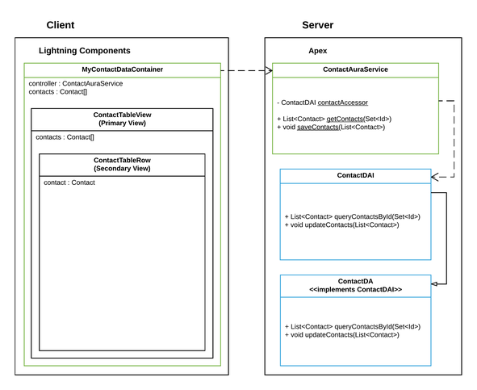

# component-types
[README](../README.md) > [best-practices](./best-practices.md) > component-types

> The contents of this page covers components by implementation. The majority of components that we write in Lightning should fall into one of these categories with few exceptions.

---

## Contents

 1. [Container Components](#markdown-header-container-components)
 2. [Layout Components](#markdown-header-layout-components)
 3. [Section Components](#markdown-header-section-components)
 4. [Collection Components](#markdown-header-collection-components)
 5. [Line Item Components](#markdown-header-line-item-components)
 6. [Field Level Components](#markdown-header-field-level-components)

---

## Container Components

> A Container Component is responsible for the primary data connection between the client and server. Queries and DML should be routed through this Container. Additionally the Container being the top level component will also be exposed as the configurable component in LEX App Builder, Community Builder, or Quick Actions.



#### Client Side
The Container Component references the AuraService. The AuraService exposes your data access, SOQL and DML. In the above example, `MyContactDataContainer` loads the page with a collection of Contact records. These Contacts are then passed into a **Primary View**, `ContactTableView`, component. The Container has no markup of its own. It's sole responsibility is to separate data access from the view.

The `ContactTableView` receiving the Contacts contains the markup for our page. Then uses an `aura:iteration` for each row in the `tbody`, passing each Contact record into a *line item* component.

Each Table Row `<tr>` is in a **Secondary View** component, `ContactTableRow`. Composing our view into a *line item* component will give us the leverage to write Javascript against an individual record if we so choose. No more writing Javascript functions to operate against an array index!

#### Server Side

The **AuraService**, `ContactAuraService`, exposes our data layer to the Lightning Container. The AuraService is not the data layer. This example shows the recommended practice for Dependency Injection. Because an AuraService is stateless, you will need to use a particular flavor of Dependency Injection, *Property Injection*.

```Java
	// Apex Property Injection Example
	private static ContactDAI contactAccessor = new ContactDA();
	public static ContactDAI ContactDI {private get; set{
		contactAccessor = value;
	}}
```

See this Container Component for ContactSearch. There is not actual markup in this component. It has `access` and `implements` attributes to expose it to config. It has a `controller` attribute for its data. Data is retrieved and passed downwards into child components. In this specific case, we also see that when the `ContactSearchForm` keys up - the Container makes the request for contacts. While this case is limited to data retrieval, the strategy can also be applied to DML.

```html
<aura:component description="ContactSearchContainer"
	access="global"
	implements="flexipage:availableForAllPageTypes"
	controller="ContactSearchAuraService" >

	<ltng:require scripts="{!$Resource.lightningKit + '/lightning-kit/js/acumen-toaster.js'}"/>

	<aura:attribute name="searchText" type="String" default="" />
	<aura:attribute name="contacts" type="Contact[]" />

	<c:ContactSearchForm searchText="{!v.searchText}" handleKeyup="{!c.onKeyUp}" />

	<aura:if isTrue="{!v.contacts.length != 0}">
		<c:ContactSearchResults contacts="{!v.contacts}" />
	</aura:if>

</aura:component>
```

---
## Layout Components

> A Layout Component is a data agnostic view component. An example of a Layout Component in Visualforce would be the `apex:pageBlock` tag. A Layout Component is only responsible for the html structure that contains your more feature driven components.

A Layout Component can stand alone as a full page grid layout, or it may depend on smaller Section Components - to further the `apex:pageBlock` analogy, think `apex:pageBlockSection` and even `apex:pageBlockSectionItem`.

In this simple example the `GridLayout` accepts three attributes of `header`, `body`, & `footer`. Assigning markup, or other components to this layout, we can reuse the same Grid Layout across multiple components.

```html
<!-- GridLayout.cmp -->
<aura:component description="GridLayout" >
	<aura:attribute name="header" type="Aura.Component[]" />
	<aura:attribute name="body" type="Aura.Component[]" />
	<aura:attribute name="footer" type="Aura.Component[]" />

	<div class="slds-grid slds-wrap">
		<div class="slds-size_1-of-1">
			{!v.header}
		</div>
		<div class="slds-size_1-of-1">
			{!v.body}
		</div>
		<div class="slds-size_1-of-1">
			{!v.footer}
		</div>
	</div>

</aura:component>

<!-- GridLayout.cmp Sample Usage -->
<c:GridLayout>

	<!-- As you can see here, Aura.Component[] attributes can take any mix or match of html and/or whole components -->
	<!-- Each `aura:set` corresponds to one of the GridLayout attributes. -->
	<aura:set attribute="header">
		<c:SomeHeaderNavLayout />
	</aura:set>

	<aura:set attribute="body">
		<div class="slds-grid slds-wrap">
			<div class="slds-size_1-of-1">
				<c:SomeAccountDetail />
			</div>

			<div class="slds-size_1-of-2">
				<c:SomeAccountForm />
			</div>

			<div class="slds-size_1-of-2">
				<c:SomeRelatedAccountLists />
			</div>
		</div>
	</aura:set>

	<aura:set attribute="footer">
		Justin Lyon &copy; 2017
	</aura:set>
</c:GridLayout>
```

---
## Section Components

> A Section Component is a data agnostic, minor layout - dependent on a parent Layout Component. The analogy in Visualforce would be the `apex:pageBlockSectionItem`, `apex:pageBlockSection`, and their greater Layout component the `apex:pageBlock`.

Consider this `GridLayoutItem` in conjunction with the previous `GridLayout` in Layout Components. Adjusting the `GridLayout` to accept a single `Aura.Component[]` attribute we could iterate over a collection of data and place into the GridLayout and for each index in the array, place a GridLayoutItem for that single point of data.

```html
<aura:component description="GridLayoutItem" >
	<aura:attribute name="content" type="Aura.Component[]" />

		<div class="slds-size_1-of-1">
			{!v.content}
		</div>

</aura:component>
```

---
## Collection Components

> Collection Components are Layout Components that are dependent on a collection of data. For example, given a collection of data - display it in a Grid or Table. In Visualforce, the analogy would be `apex:pageBlockTable`.

The below example is a Collection Component. Given an array of Contacts, it displays the contacts in a table. It does not care where the data comes from, only that it has been passed in. This component has no need for a Controller or Helper.js.

```html
<aura:component description="ContactTable" >
	<aura:attribute name="contacts" type="Contact[]" />

	<div class="slds-p-horizontal_x-small" >
		<table class="slds-table slds-table_bordered slds-table_fixed-layout">
			<thead>
				<tr class="slds-text-title_caps">
					<th scope="col" class="slds-theme_info">
						<div class="slds-truncate">Name</div>
					</th>
					<th scope="col" class="slds-theme_info">
						<div class="slds-truncate">Title</div>
					</th>
					<th scope="col" class="slds-theme_info">
						<div class="slds-truncate">Phone</div>
					</th>
					<th scope="col" class="slds-theme_info">
						<div class="slds-truncate">Email</div>
					</th>
				</tr>
			</thead>
			<tbody>

				<aura:iteration items="{!v.contacts}" var="contact">
					<c:ContactRow contact="{!contact}" />
				</aura:iteration>

			</tbody>
		</table>
	</div>

</aura:component>
```

---
## Line Item Components

> Line Item Components are view components dependent on a single row of data. They are likely employed as a child of a Collection Component, but this is not mandatory. Like the Collection Component, it does not care where the data comes from - only that it exists.

In the previous Collection Component example, `ContactTable` - you may have noticed the iteration:
```html
...
<tbody>

	<aura:iteration items="{!v.contacts}" var="contact">
		<c:ContactRow contact="{!contact}" />
	</aura:iteration>

</tbody>
...
```

For each Contact in this ContactTable Collection Component, we iterate over the Contacts passing them in one at a time to the `ContactRow`. Let's take a peek at the contents of this Line Item Component.

ContactRow may be a fairly self explanatory name, but imagine if you build this table and in the future are asked to add row level functionality. Users want to edit cells in the table. Users want to have clickable links.

Having the Line Item Component allows us to write javascript directly against this local record rather than having to traverse a collection to find the record someone clicked on beforehand. Unlike the Collection Component, it is highly likely that a Line Item Component will include a Controller and Helper.js in the bundle.

```html
<aura:component description="ContactRow" >
	<aura:attribute name="contact" type="Contact" />

	<tr>
		<th scope="row" data-label="Name">
			<c:NavigateSObjectLink recordId="{!v.contact.Id}" >
				<aura:set attribute="content">
					<div title="{!v.contact.Name}">
						<ui:outputText value="{!v.contact.Name}" />
					</div>
				</aura:set>
			</c:NavigateSObjectLink>
		</th>

		<td data-label="Title">
			<div class="slds-truncate" title="{!v.contact.Title}" >
				<ui:outputText value="{!v.contact.Title}" />
			</div>
		</td>
		<td data-label="Phone">
			<div class="slds-truncate" title="{!v.contact.Phone}" >
				<ui:outputText value="{!v.contact.Phone}" />
			</div>
		</td>
		<td data-label="Email">
			<div class="slds-truncate" title="{!v.contact.Email}" >
				<ui:outputText value="{!v.contact.Email}" />
			</div>
		</td>
	</tr>

</aura:component>
```

---
## Field Level Components

> Field Level Components are unique. They are isolated components that perform a specific task that can be re-used across many different components. In Visualforce you might think of the `apex:inputField` or `apex:selectList`. Additionally, Field Level Components are excellent for repeatable business use cases.

Being isolated, a Field Level Component should not bind complex attributes or object types between itself and its parent. The parent holds the complex data, only binding down the individual property it wants to bind to the Field Level Component.

Take a picklist as a common Field Level Component.

This picklist component accepts three attribute inputs. `boundValue`, `objectApiName`, & `fieldApiName` - all that it needs to retrieve the picklist options with a Schema Describe for the object and field in its AuraService then bind the selected value back into its parent.

Being a specialized component, it makes sense for Field Level Components to have their own AuraService. This is only the second component since the Container Component that would likely have an AuraService associated to it.

```html
<!-- Picklist.cmp -->
<aura:component description="Picklist" controller="PicklistAuraService">
	<aura:attribute name="objectApiName" type="String" required="true" description="SObject API Name" />
	<aura:attribute name="fieldApiName" type="String" required="true" description="Field API Name" />

	<aura:attribute name="boundValue" type="String" />

	<aura:attribute name="options" type="Array" default="[]" />
	<aura:attribute name="fieldDescribe" type="Object" default="{}" />

	<aura:handler name="init" value="{!this}" action="{!c.init}" />

	<lightning:select name="picklist" value="{!v.boundValue}" label="{!v.fieldDescribe.label}">
		<aura:iteration var="opt" items="{!v.options}" >
			<option text="{!opt.label}" value="{!opt.value}" selected="{!opt.selected}" />
		</aura:iteration>
	</lightning:select>
</aura:component>

<!-- Picklist.cmp usage -->
<c:Picklist boundValue="{!v.newCase.Status}"
	objectApiName="Case"
	fieldApiName="Status" />
```
