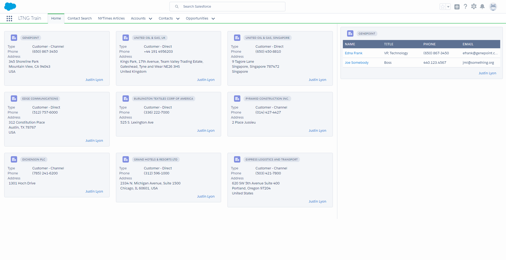

# 01.00-my-first-lightning-app
[README](../../../README.md) > [Introduction](../../introduction.md) > 01.00-instructions

---

> In this activity you will build your first Lightning App. We will first create a completely out of the box Lightning App using Lightning App Builder. Then we will build two Lightning Components for this App, an Account Grid and a Related Contacts Table. Clicking on an Account will fire an Application Event, The Related Contacts Table will handle the event and update itself with the Related Contacts for the clicked Account.

> If you haven't yet, please see the [00-getting-started](../00-getting-started/instructions.md) to prepare your sandbox for this activity.

Training Home Tab

---
## modules

 1. [01.01-lightning-app-builder](01.01-lightning-app-builder.md)
 2. [01.02-custom-lightning-component](01.02-custom-lightning-component.md)
 3. [01.03-configurable-attribute](01.03-configurable-attribute.md)
 4. [01.04-auraservice](01.04-auraservice.md)
 5. [01.05-consuming-the-auraservice](01.05-consuming-the-auraservice.md)
 6. [01.06-composing-components](01.06-composing-components.md)
 7. [01.07-slds-styling](01.07-slds-styling.md)
 8. [01.08-diy-contacts](01.08-diy-contacts.md)
 9. [01.09-application-event](01.09-application-event.md)
 10. [01.10-icons-and-links](01.10-icons-and-links.md)

 

[Next](01.01-lightning-app-builder.md)
