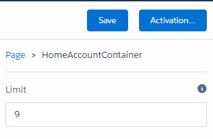

# 01.03-configurable-attribute

[README](../../../README.md) > [Introduction](../../introduction.md) > 01.03-configurable-attribute

> In the previous section we added our first `aura:attribute`. Let's add a new attribute exposed to App Builder so our System Administrators can configure it on the fly.

Bind this new `limitter` attribute to your component view.

```html
<aura:component description="HomeAccountContainer" access="global" implements="flexipage:availableForAllPageTypes">
	<aura:attribute name="sample" type="String" default="Test"/>
	<aura:attribute name="limitter" type="Integer" default="10"/>
	<div>{!v.sample}</div>
	<div>{!v.limitter}</div>
</aura:component>
```

Save the component and refresh the Training Home Tab. What do you expect to see?

You should see:

> Test

> 10

 * In the `HomeAccountContainer` bundle will be a `.design` file, `HomeAccountContainer.design`. If not, create it.
	* This file exposes .cmp `aura:attribute`s to the App Builder.
	* Add the following to your `HomeAccountContainer.design` file.

> (!) Not all IDEs support editing a `.design` file, you may need to create and edit this file in SF Dev Console.

```html
<design:component >
	<design:attribute name="limitter" label="Limit" description="Limit the number of Accounts displayed" />
	<sfdc:objects >
		<sfdc:object >Account</sfdc:object>
	</sfdc:objects>
</design:component>
```

Here we're telling the App Builder that our component has an `aura:attribute` named "limitter" to be available for config in App Builder. We define the Label and Description for the field in App Builder here, the type is carried up from the `aura:attribute` definition. Only primitive types can be exposed as configurable values. No Ids, lookups, or objects.

Let's test this out to make sure we're on track.

Cool! Now go edit the Home Account Page in App Builder. Click on your custom component in the canvas, and change the value of limitter.

On the right hand side of the App Builder, under Save/Activation you should see:



Save and refresh the Training Home Tab to confirm the limitter value has been updated to the number you set in App Builder.

[Previous](01.02-custom-lightning-component.md) | [Next](01.04-auraservice.md)
