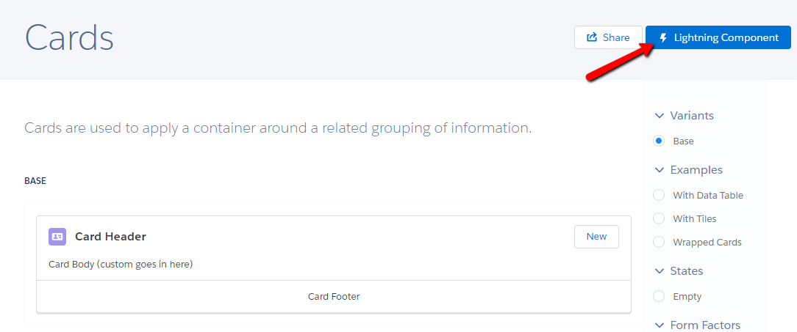

# 01.07-slds-styling

[README](../../../README.md) > [Introduction](../../introduction.md) > 01.07-slds-styling

> This module will focus on applying Salesforce Lightning Design System (SLDS) Styles to the `HomeAccountContainer`'s child components.

## Intro to SLDS

SLDS, sometimes referred to as LDS, is Salesforce's css library for Lightning. It can be compared to other CSS Libraries such as the ubiquitous Bootstrap.

[SLDS Documentation](https://lightningdesignsystem.com/getting-started/)

> (!) While browsing the SLDS Documentation, you may notice a button in the top right corner, _Lightning Component_. If this button is displayed on a particular SLDS page, this means there is a Lightning Base Component that will provide this style for you.

> 

## Layouts

Coming from Visualforce, you should be most familiar with Layout Tables. Using html tables to layout your page. These are not responsive, and not 508 compliant. The use of Tables to layout a page has been a clever trick, but was never the intended use for Tables.

### Data Tables

Tables are meant to be used as Data Tables. Use a Data Table to display collections of data.

[SLDS Data Table](https://lightningdesignsystem.com/components/data-tables/#content)

### Grids

Grids are the new tool for laying out our page. Grids are responsive by design, and can be easily written for various media types and view port sizes.

Grids can also be used to display collections of data when combined with an `aura:iteration`.

[SLDS Grid](https://lightningdesignsystem.com/utilities/grid/#content)

### Cards

Cards are for individual record views. A Grid may iterate over a collection and for each record display it in a Card.

[SLDS Card Documentation](https://lightningdesignsystem.com/components/cards/#content)

## The AccountGrid

The AccountGrid defines a grid with a div. We're using two helper classes here.

 * `slds-wrap`
	* If our columns exceed the width of our row, wrap them to a new row.
 * `slds-grid_pull-padded`
	* If our grid is inheriting padding, escape this. Useful when nesting grids.

Within the iteration, we are using manual sizing. `slds-medium-size_1-of-3` is our default size that will be applied to medium and larger screen types.

Add a manual size for mobile devices, `slds-small-size_1-of-1`. Now if this grid is displayed on a phone, each row will only hold one Account.

```html
<aura:component description="AccountGrid" >

	<aura:attribute name="accounts" type="Account[]" />

	<div class="slds-grid slds-wrap slds-grid_pull-padded" >
		<aura:iteration var="acc" items="{!v.accounts}" >

			<div class="slds-small-size_1-of-1 slds-medium-size_1-of-3" >
				<c:AccountCard account="{!acc}" />
			</div>
		</aura:iteration>
	</div>
</aura:component>
```

## The Account Card

Now we'll start making this look pretty.

[SLDS Cards](https://lightningdesignsystem.com/components/cards/#content) are available to us in the form of a [Lightning Base Component](https://developer.salesforce.com/docs/atlas.en-us.206.0.lightning.meta/lightning/aura_compref_lightning_card.htm), so we don't need to hand write the styles!

### lightning:card

This Lightning Base Component has many attributes and should feel very familiar to those who've been living in Visualforce. We can create a very simple card by assigning text values to the card attributes of `title`, `body`, and `footer`. But it gets better - a Lightning Card accepts blocks of markup for its various sections. Meaning we can pass in other components or blocks of html to each of these in order to compose our card.

Explore the [Lightning Card Documentation](https://developer.salesforce.com/docs/atlas.en-us.206.0.lightning.meta/lightning/aura_compref_lightning_card.htm) for its various attributes.

Start by adding this line to your AccountCard.
`<lightning:card title="My Title" body="I'm the body" footer="I'm the footer" />`

Now update this card, binding the Account.Name to the `title` and the Account.Owner.Name to the `footer`.

Next, add a closing tag for your card instead of `/>` self-closing.

Now inside the Lightning Card tags place the Account.Type, Account.Phone, and Account.BillingAddress.street bindings here with `ui:outputText` to safely bind your data into the page.

`<lightning:card>` has an attribute, `body` of type Aura.Component[]. By placing markup within the <lightning:card> tag, we are setting the `body` attribute of the card.

`body` is the lightning card's default Aura.Component[] attribute. To do the same with the `title` and `footer` we'll need to tell the card with `aura:set` tags.

 1. Remove the title and footer attributes from the card tag.
 2. Add `<aura:set attribute="title"></aura:set>` and `<aura:set attribute="footer"></aura:set>` to the contents of the `<lightning:card>`.
 3. Within the `title` setter, use a `lightning:badge` to display the Account Name.
 4. Within the `footer` setter, use a `ui:outputText` to display the Owner Name.

AccountCard

```html
<aura:component description="AccountCard" >

	<aura:attribute name="account" type="Account" />

	<lightning:card >
		<aura:set attribute="title">
			<lightning:badge label="{!v.account.Name}" />
		</aura:set>

		<ui:outputText value="{!v.account.Type}" />
		<ui:outputText value="{!v.account.Phone}" />
		<ui:outputText value="{!v.account.BillingAddress.street}" />

		<aura:set attribute="footer">
			<ui:outputText value="{!v.account.Owner.Name}" />
		</aura:set>
	</lightning:card>
</aura:component>
```

## Padding and Margin

Your AccountGrid and Card UI is really taking shape, but the padding is off.

SLDS has padding and margin helper classes that can applied just about anywhere.

Add an `slds-p-around_small` to the sizing div in AccountGrid. This will pad your Cards from all sides.

Feel free to add additional padding to the `AccountCard` to pad your text from the left side.

> (!) Experimenting with `slds-p` versus `slds-m`, you will find that margin styles are included in grid width calculations. If we apply an `slds-m-around_small` instead of `p`, we'll find that our Grid will only display two Account Cards per row because the margin helper class increases the row width beyond 100%.

Additional documentation on [SLDS Padding Utilities Here](https://lightningdesignsystem.com/utilities/padding/)

```html
<aura:component description="AccountGrid" >

	<aura:attribute name="accounts" type="Account[]" />

	<div class="slds-grid slds-wrap slds-grid_pull-padded" >
		<aura:iteration var="acc" items="{!v.accounts}" >

			<div class="slds-small-size_1-of-1 slds-medium-size_1-of-3 slds-p-around_small" >
				<c:AccountCard account="{!acc}" />
			</div>
		</aura:iteration>
	</div>
</aura:component>
```

[Previous](01.06-composing-components.md) | [Next](01.08-diy-contacts.md)
