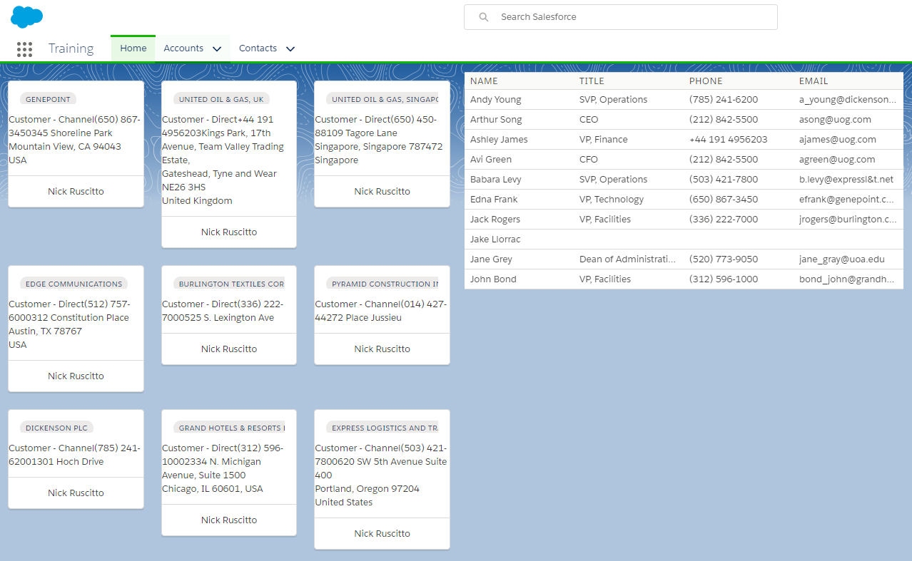

# 01.08-diy-contacts

[README](../../../README.md) > [Introduction](../../introduction.md) > 01.08-diy-contacts

> Apply what you've learned from the previous modules to build your own custom Contact Related List.

## Requirements

 * Display 10 Contacts in a Data Table.
 * Columns: Name, Title, Phone, & Email
 * Use the [Container Pattern](../../../development-practices/component-types.md#markdown-header-container-components)
 * [Compose your Components](01.06-composing-components.md) with a Table Component and Line-Item Component
 * Add the Container to the Training Home Tab, [Lightning App](01.01-lightning-app-builder.md).
 * Components required
	1. RelatedContactsContainer
	2. ContactTable
	3. ContactRow
 * [Apex Required](01.04-auraservice.md)
	1. RelatedContactsAuraService
	2. ContactDAI, interface
	3. ContactDA

This should be a simple exercise of retrieving 10 Contact records on page load and displaying them in a table. Once you have completed this exercise, we will expand, refactor, and style it to appear as it does below.

When you are completed, compare your work to the completed components in this repository.

* [ContactTable](../../../src/aura/ContactTable)
* [ContactRow](../../../src/aura/ContactRow)

 [Previous](01.07-slds-styling.md) | [Next](01.09-application-event.md)
