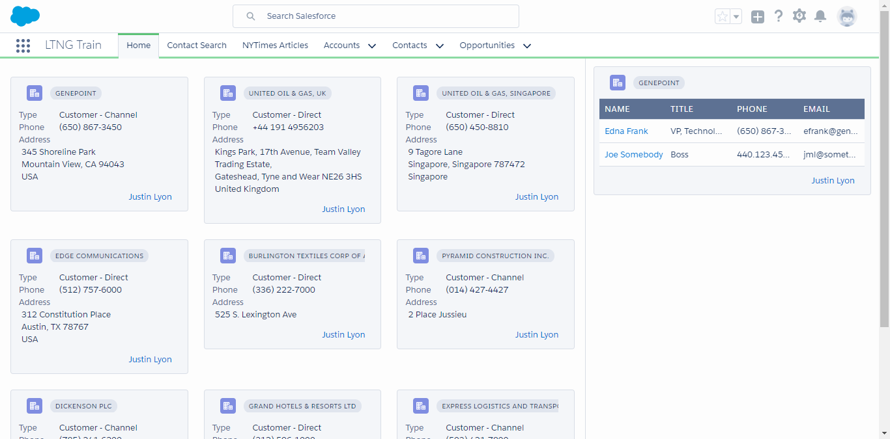

# 01.10-icons-and-links

[README](../../../README.md) > [Introduction](../../introduction.md) > 01.10-icons-and-links

> Bonus Round. Time for some clean up and making this look presentable to the client. We'll be adding links, icons, static resources, and in general cleaning up the UI for the components that we've built so far.

---
## Icons

[SLDS Icons](https://www.lightningdesignsystem.com/icons/) are grouped by categories. Typical reference syntax is `category:iconName`. SLDS Icons are SVGs and may not be supported natively on all browsers. Salesforce recommends the use of [svg4everybody](https://github.com/jonathantneal/svg4everybody) to polyfill the support to your app.

---
## Links

Lightning Experience is a Single Page Application (SPA). Gone are the URL links and URL params of Classic Salesforce. No more copying a record Id from a Salesforce URL, `?id=005xxxxxxxxxxxx`. In order to "link" in Salesforce we take advantage of the `force:navigateTo` events.

To Name a few:

 * `force:navigateToObjectHome` - Open Object List View
 * `force:navigateToSObject` - Open Record Detail Page
 * `force:navigateToURL` - Open a URL, opens a new browser tab.

---
## Static Resources

Static Resources continue to be a useful tool to manage shared utilities across our codebase. There is one major change when working with Javascript Static Resources. Lightning Experience and LockerService requires that JS Static Resources are Immediately Invoked Function Expressions assigned to Global Variables -  [IIFE](https://developer.mozilla.org/en-US/docs/Glossary/IIFE).

Use the provided Static Resource in [00-getting-started](../00-getting-started/instructions.md) > [LightningKit](https://bitbucket.org/acumensolutions/lightning-kit/overview) to complete the remaining tasks.

Including Static Resources with [`ltng:require`](https://developer.salesforce.com/docs/atlas.en-us.lightning.meta/lightning/aura_compref_ltng_require.htm)

```html
<aura:component>
	<ltng:require
			styles="{!join(',',
			$Resource.LightningKit + '/lightning-kit/css/master.css')}"
			scripts="{!join(',',
			$Resource.lightningKit + '/lightning-kit/js/acumen-navigator.js',
			$Resource.lightningKit + '/lightning-kit/js/acumen-toaster.js')}" />
</aura:component>
```

If multiple components `require` the same static resource, Lightning will, correctly, only include it once.

---
## Bells and Whistles

Add Icons, Links, and Static Resources to the Training Home Tab App.

 1. Refactor the AccountCard's `ui:` tags into a new component named AccountSummary.
 2. Refactor the AccountCard to accept an attribute of type Aura.Component[] to set the card content.
	* Set your AccountCard content from the AccountGrid using the ClickableAccount and AccountSummary.
 3. Add an icon to the lightning:card in AccountCard.
	* Refer to the documentation for lightning:card
	* Search SLDS Icons for a full list of available Icons
 4. Use a grid in AccountSummary to layout the label value pairs for the fields in view.
	* Use SLDS padding utilities to correct any alignment issues between the summary and the card.
 5. Make the Account Name and Owner Name of the AccountCard clickable links.
	* You should use the LightningKit static resource from [00-getting-started](../00-getting-started/instructions.md)
	* Create a Field Level Component that will link to a record detail page.
		* Given a record Id and a `content` Aura.Component[], use the static resource to execute your link.
		* Use this component for both the `title` and `footer` on the `lightning:card` in AccountCard.
 6. Refactor the RelatedContactsContainer.cmp to wrap the ContactTable with the AccountCard. Using the Account from SelectedAccount event to populate the card.
 7. Use the LightningKit `master.css` to apply the blue background and white text styles for the Contacts Table Header.
 8. Using the LightningKit, replace the `console.logs` in the callback error handlers with toasts.

Finished Product!



[Previous](01.09-application-event.md) | [01.00-instructions](01.00-instructions.md)
