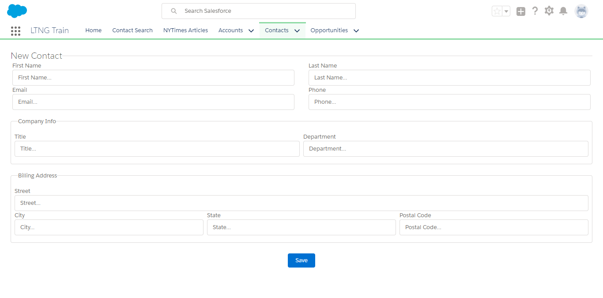

# 02.00-form-entry

[README](../../../README.md) > [Introduction](../../introduction.md) > 02.00-form-entry

> In this activity we will build a basic form that overrides the New Contact button. We will apply the Container Pattern to a Form in Lightning Experience.

> This activity assumes basic understanding of Lightning Components, the Container Pattern, and AuraServices. Further reading on these topics can be found in [01-my-first-lightning-app](../01-my-first-lightning-app/01.00-instructions.md).

---
## Requirements:

 1. Override the standard New Contact button with a custom Lightning Component Form.
 2. Use the Container Pattern
 3. Use Property Injection to expose an `insertContact` method through the NewContactAuraService.
 4. Use `acumen-toaster.js` from the LightningKit static resource to provide success/error feedback to the user.

---
## modules

 1. [02.01-server-side](02.01-server-side.md)
 2. [02.02-client-side-container](02.02-client-side-container.md)
 3. [02.03-client-side-view](02.03-client-side-view.)

---

[Next](02.01-server-side.md)
