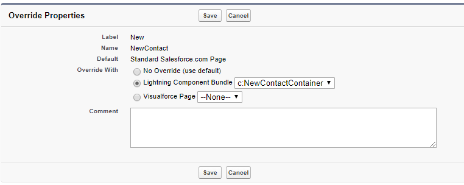

# 02.02-client-side-container

[README](../../../README.md) > [Introduction](../../introduction.md) > 02.02-client-side-container

> Setup our Client Side Container component to initialize our contact record and define our save function, referencing the NewContactAuraService.

---
## NewContactContainer

 1. Create component
	* Name: NewContactContainer
	* Bundle Files: Controller and Helper
	* Ltng Require: acumen-toaster.js
	* Attributes
		* contact, type Contact

The Container is where we manage our data and the actions performed on it. For form Entry, we need to initialize our record and define the function to save it to Salesforce. In order to maintain our data, the Container will hold the reference to our AuraService.

---
### Lightning Interface

Rather than surfacing this component to App Builder, we will be overriding the standard New Contact Button. In order to do this, we'll need a specific Lightning Interface for our Container component.

Add the following to the NewContactContainer's `aura:component` tag:

 * `implements="lightning:actionOverride,force:hasRecordId,force:hasSObjectName"`

 1. lightning:actionOverride - Interface for overriding a Standard Lightning Experience Button.
 2. force:hasRecordId & force:hasSObjectName - Interfaces similar to Visualforce's Standard Controller. Components with these interfaces have attributes of recordId and sobjectName.

In Salesforce, override the New Contact Button on the Contact Object with our NewContactContainer Lightning Component Bundle.

 * Setup > Object Manager > Contact > Buttons Links and Actions



---
### Initialization

On `init` the Container initializes the Contact record. The `.cmp` needs an init handler to call a Controller.js function `.init()` which calls our Helper.js function `.initializeContact()`.

The `helper.initializeContact()` function looks like

```javascript
	initializeContact : function(cmp) {
		var contact = {
			sobjectType: "Contact",
			FirstName: "",
			LastName: "",
			BillingStreet: "",
			BillingCity: "",
			BillingState: "",
			BillingPostalCode: "",
			Email: "",
			Phone: "",
			Title: "",
			Department: "",
		};

		cmp.set("v.contact", contact);
	},
```

Initializing a record in Lightning must set all fields we need to empty string. This ensures that the fields are registered for data binding in the Lightning Framework when we set this record to our component object. Additionally, we are explicitly defining the `sobjectType` of this record.

---
### Save Contact

Saving the Contact will take advantage of a new Attribute type, the Aura.Action.

Aura.Action is defined as an attribute on a child component. A parent component may bind a controller function to this attribute, allowing the child component to assign that function to a DOM Event in its markup. Following this strategy, we'll write our save function in the NewContactContainer's Controller and Helper JS, and pass it down later to our form view - eventually binding it to our Save button.

---
#### Container Functions

 * NewContactContainerController: `saveContact : function(cmp, event, helper)`
 * NewContactContainerHelper: `createContact: function(cmp)`

Write out the Helper function to save our Contact record. If the save is successful, use the LightningKit Static Resource's `acumen-toaster.js` to display a Success Toast. If there is an error on save, display an Error Toast.

Write out the Controller function to expose the `helper.createContact` function.

[Previous](02.01-server-side.md) | [Next](02.03-client-side-view.md)
