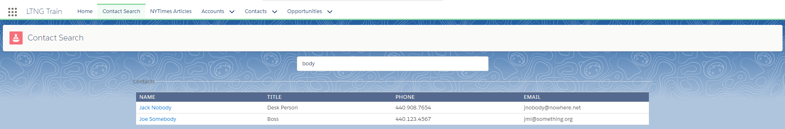

# 03.00-custom-search

[README](../../../README.md) > [Introduction](../../introduction.md) > 03.00-custom-search

> Build a custom search page for Contacts using the Container Pattern. Exposed it to Lightning Experience as a Custom Tab in the Training App.

> This activity assumes basic understanding of Lightning Components, the Container Pattern, and AuraServices. Further reading on these topics can be found in [01-my-first-lightning-app](../01-my-first-lightning-app/01.00-instructions.md).

---
## Requirements:

 1. Expose Query Contacts by Name from Contact Data Accessor through ContactSearchAuraService.
 2. Create Lightning Component Container for Search Page.
 3. Create Search Form view component with Text Input for Contact Name.
 4. Re-use the Contact Table from [01.08-diy-contacts](../01-my-first-lightning-app/01.08-diy-contacts.md) to display Contact Search Results.

---
## modules

 1. [03.01-server-side](03.01-server-side.md)
 2. [03.02-client-side-container](03.02-client-side-container.md)
 3. [03.03-client-side-form](03.03-client-side-form.md)
 4. [03.04-client-side-table](03.04-client-side-table)
 5. [03.05-debouncing](03.05-debouncing.md)

---

[Next](03.01-server-side.md)
