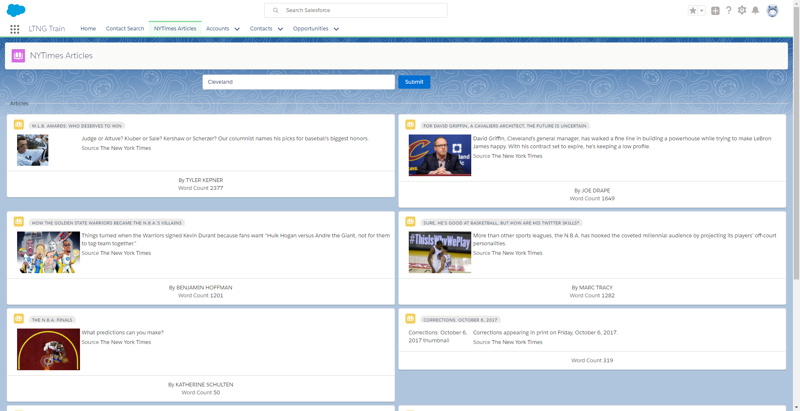

# 04.00-super-components

[README](../../../README.md) > [Introduction](../../introduction.md) > 04.00-super-components

> This activity will use the NYTimes Articles API to showcase the consumption of an API with a Lightning Super Component. In order to complete this activity, you will need to setup an API Config Custom Setting explained in [00-getting-started](../00-getting-started/instructions.md#markdown-header-add-api-config-custom-setting).

---
## Requirements

 1. Write a server side HttpCallout in Apex, exposed by AuraService.
 2. Build a Super Component to share callout functionality by extension.
 3. Create a new Container as a Custom Tab in our Training App
 4. Extend the Super Component on the Container
 5. Develop a Grid/Card UI similar to the Home Tab AccountGrid to display results.

---
## modules

 1. [04.01-server-side](04.01-server-side.md)
 2. [04.02-super-component](04.02-super-component.md)
 3. [04.03-client-side-container](04.03-client-side-container.md)
 4. [04.04-client-side-view](04.04-client-side-view.md)

[Next](04.01-server-side.md)
